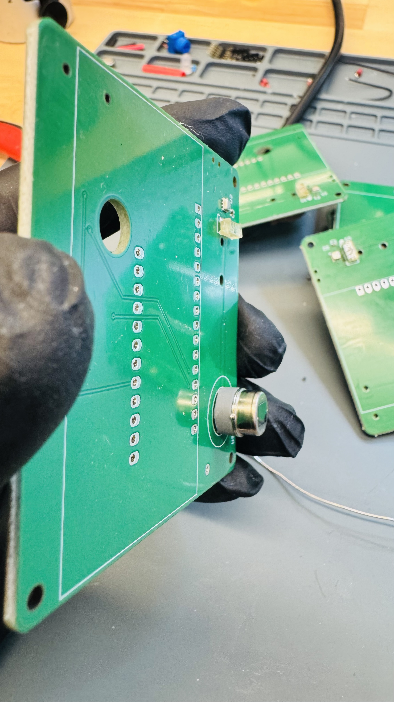
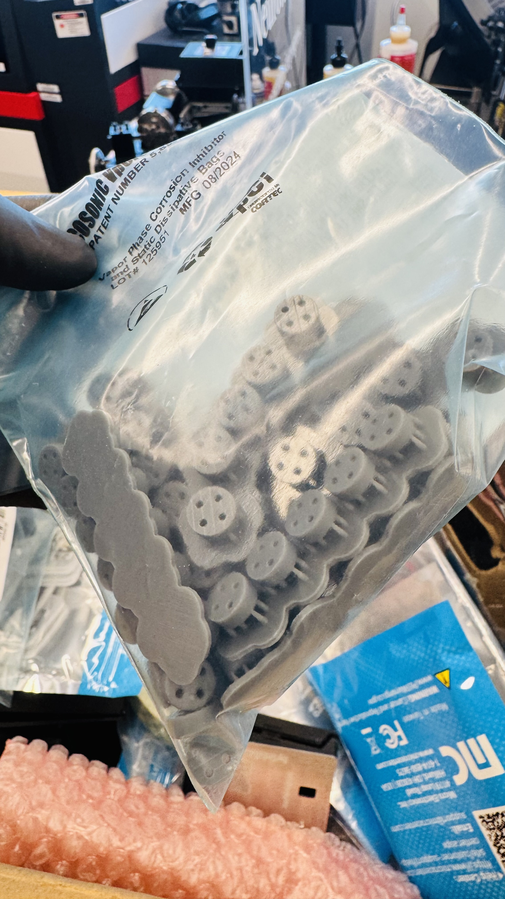
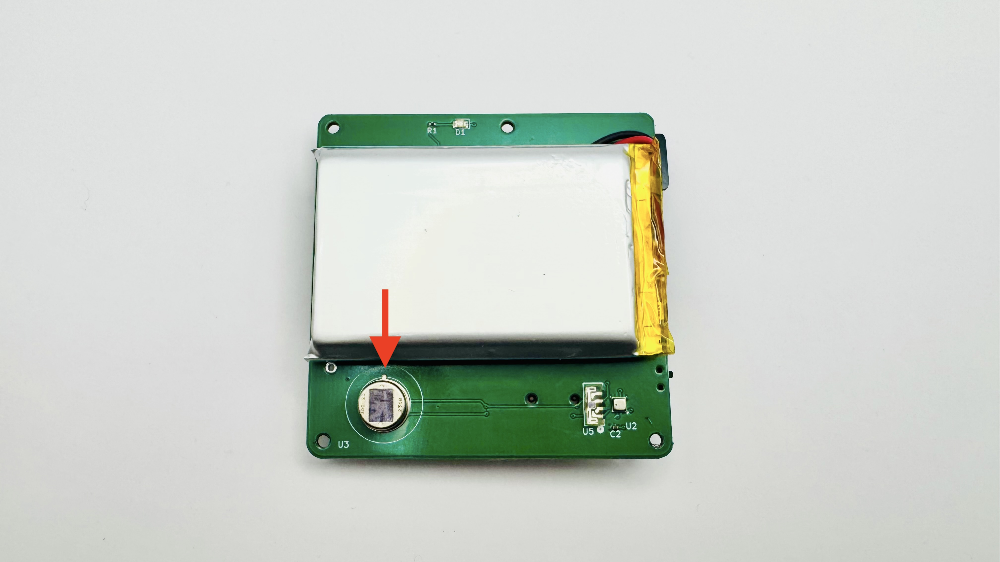
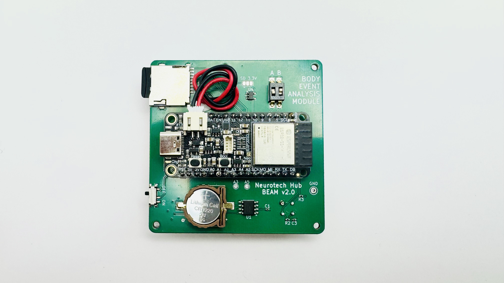
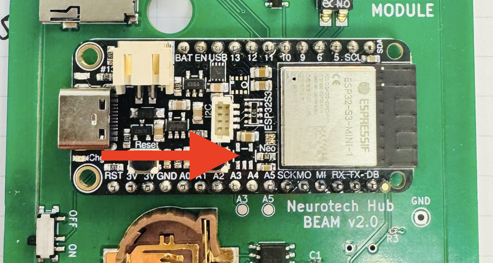

# BEAM Assembly Instructions

## Circuit Assembly

1. Solder Adafruit ESP32-S3 Feather to the board.
2. Insert a PIR sensor standoff (printed in bulk from resin). Solder PIR sensor to the board (see orientation in the image below).







3. Apply ~2" of double-sided tape to the battery and thread it through the hole ensuring it has enough slack to plug in. You may choose to keep the wire behind the module, just beware it may require some position to not interfere with the mounting screws.



5. Inser the coin cell for the RTC.
6. Turn the module "OFF" and ensure both switches remain "UP" (towards the A/B markers) for production deployment.

### Low Power Modification

The Adafruit ESP32-S3 Feather has an onboard LDO for the I2C port. It was unclear for BEAM v2.0 that the LDO's output is driven in shutdown mode; this conflicts with I2C operations and draws an additional ~1.5mA. **The feather's LDO needs to be removed** to reduce power consumption.



1. Apply flux and hot air (~335°C) to lift off the 5-pin chip above the A3 and A4 pins. Do not scortch the adjecent button or stemma QT connector.
2. Clean the affected area with isopropyl alcohol.

### Quality Control

1. Check all solder joints for full coverage, bridging, and balling.
2. Before flashing BEAM code, the Adafruit ESP32-S3 Feather will run a I2C scan that will print the addresses of all connected I2C devices. Simply turn BEAM "ON", connect to Arduino IDE, and you should see the following in the serial monitor:

```
I2C scanner: 0x00, 0x10, 0x36, 0x68, 0x77, 0x7B
```

These addresses correspond to the following devices:

- 0x00 - ZDP323 (pir sensor, general call)
- 0x10 - VEML7700 (lux)
- 0x36 - MAX17048 (battery)
- 0x68 - DS3231 (RTC)
- 0x77 - BME280 (env. sensor)
- 0x7B - ZDP323 (pir sensor, 10-bit 0x302 falls back to 0x7B)

Do not proceed if any of these addresses are missing.

## Flashing BEAM Code

1. Connect to Arduino IDE.
2. If the board type defaults to "ESP 32 Device", change it to "Adafruit ESP32-S3 Feather 2MB PSRAM" via Tools > Board. You will need "esp32" by espressif in Boards Manager.
3. Hold shift and click upload: this flushes any cached compilations in order to properly set the RTC.
4. Upon successful upload you should see an initialization report. In production mode (switch A is up), there may not be a sufficient delay for the serial port to show the report: you may temporarily turn switch A down to include delays to see the report.

## Enclosure Assembly

1. Cut 2mm hinges to length. Align the two case parts and insert the hinge to ensure it has sufficient purchase on each side of the case back hinge elements. You may need to use a hammer to gently tap it into place (from the top) using another 2mm hinge section to get it properly aligned.
2. Press-fit the PIR sensor lens into the case.
3. Screw on the aluminum front plate (two M2 x 5mm screws).
4. Add PCB assembly to the case (four M2 x 5mm screws).

Note: screw holes are self-tapping. They take light pressure to thread but will not last forever and can strip with too much force.