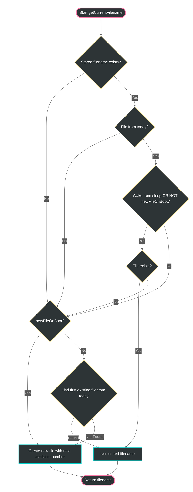

```mermaid
%%{init: {
    'theme': 'dark',
    'themeVariables': {
        'fontFamily': 'arial',
        'fontSize': '16px',
        'primaryColor': '#1a1a1a',
        'primaryTextColor': '#fff',
        'primaryBorderColor': '#fff',
        'lineColor': '#666',
        'secondaryColor': '#2a2a2a',
        'tertiaryColor': '#2a2a2a'
    }
}}%%
flowchart TD
    %% Title handling
    title[Filename Selection Logic]
    style title fill:none,stroke:none,color:#fff,font-size:20px,font-weight:bold

    %% Main flow
    Start([Start getCurrentFilename])
    A{Stored filename exists?}
    B{File from today?}
    C{Wake from sleep OR NOT newFileOnBoot?}
    D{File exists?}
    E{newFileOnBoot?}
    F{Find first existing file from today}
    UseStored[Use stored filename]
    CreateNew[Create new file with next available number]
    End([Return filename])

    %% Connections
    Start --> A
    A -->|No| E
    A -->|Yes| B
    B -->|No| E
    B -->|Yes| C
    C -->|Yes| D
    C -->|No| E
    D -->|Yes| UseStored
    D -->|No| E
    E -->|Yes| CreateNew
    E -->|No| F
    F -->|Found| UseStored
    F -->|Not Found| CreateNew
    UseStored --> End
    CreateNew --> End

    %% Styling
    classDef default fill:#2d3436,stroke:#00cec9,stroke-width:2px,color:#fff
    classDef decision fill:#2d3436,stroke:#ffeaa7,stroke-width:2px,color:#fff
    classDef process fill:#2d3436,stroke:#00cec9,stroke-width:2px,color:#fff
    classDef start fill:#2d3436,stroke:#fd79a8,stroke-width:3px,color:#fff
    classDef endNode fill:#2d3436,stroke:#fd79a8,stroke-width:3px,color:#fff

    %% Apply classes
    class A,B,C,D,E decision
    class F decision
    class UseStored,CreateNew process
    class Start start
    class End endNode
``` 