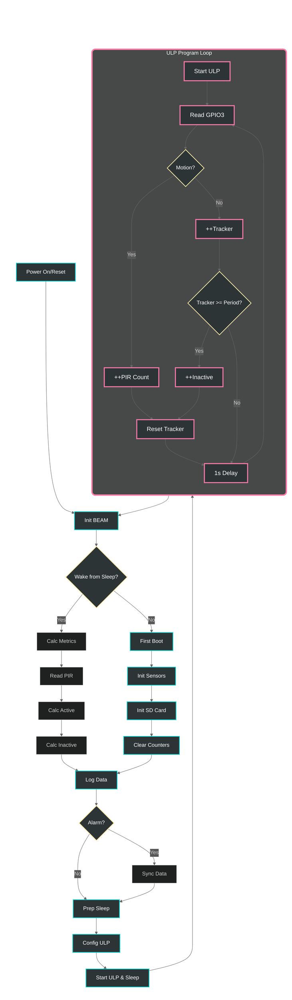

```mermaid
%%{init: {
    'theme': 'dark',
    'themeVariables': {
        'fontFamily': 'arial',
        'fontSize': '16px',
        'primaryColor': '#1a1a1a',
        'primaryTextColor': '#fff',
        'primaryBorderColor': '#fff',
        'lineColor': '#666',
        'secondaryColor': '#2a2a2a',
        'tertiaryColor': '#2a2a2a'
    }
}}%%
flowchart TB
    %% Title in upper left
    title["Hublink BEAM Flowchart"]
    style title fill:none,stroke:none,color:#fff,font-size:20px,font-weight:bold
    
    %% Position title to the left of Start
    title --> Start
    linkStyle 0 stroke:none
    
    %% ULP Program Flow - Starts here after deep sleep
    subgraph ULP [ULP Program Loop]
        direction TB
        style ULP stroke-width:4px,stroke:#fd79a8,rx:10
        ULPStart[Start ULP] --> ReadGPIO[Read GPIO3]
        ReadGPIO --> Motion{Motion?}
        Motion -- Yes --> IncPIR[++PIR Count]
        IncPIR --> ResetTracker[Reset Tracker]
        Motion -- No --> IncTracker[++Tracker]
        IncTracker --> CheckPeriod{Tracker >= Period?}
        CheckPeriod -- Yes --> IncInactive[++Inactive]
        IncInactive --> ResetTracker
        CheckPeriod -- No --> Delay[1s Delay]
        ResetTracker --> Delay
        Delay --> ReadGPIO
    end
    
    %% Main Program Flow - After ULP or power on
    Start[Power On/Reset] --> Init[Init BEAM]
    ULP --> Init
    Init --> CheckWake{Wake from Sleep?}
    
    %% First Boot Path
    CheckWake -- No --> FirstBoot[First Boot]
    FirstBoot --> InitSensors[Init Sensors]
    InitSensors --> InitSD[Init SD Card]
    InitSD --> ClearCounters[Clear Counters]
    
    %% Wake from Sleep Path
    CheckWake -- Yes --> CalcMetrics[Calc Metrics]
    CalcMetrics --> ReadPIR[Read PIR]
    ReadPIR --> CalcActive[Calc Active]
    CalcActive --> CalcInactive[Calc Inactive]
    
    %% Main Loop from BasicLoggingHublink.ino
    CalcInactive --> LogData[Log Data]
    ClearCounters --> LogData
    LogData --> CheckAlarm{Alarm?}
    CheckAlarm -- Yes --> SyncData[Sync Data]
    CheckAlarm -- No --> PrepSleep[Prep Sleep]
    SyncData --> PrepSleep
    
    %% Sleep Preparation
    PrepSleep --> ConfigULP[Config ULP]
    ConfigULP --> StartULP[Start ULP & Sleep]
    StartULP --> ULP

    %% Styling
    classDef process fill:#2d3436,stroke:#00cec9,stroke-width:2px,color:#fff
    classDef decision fill:#2d3436,stroke:#ffeaa7,stroke-width:2px,color:#fff
    classDef ulp fill:#2d3436,stroke:#fd79a8,stroke-width:3px,color:#fff,font-size:18px
    
    class Start,Init,FirstBoot,InitSensors,InitSD,ClearCounters,LogData,PrepSleep,ConfigULP,StartULP process
    class CheckWake,CheckAlarm,Motion,CheckPeriod decision
    class ULPStart,ReadGPIO,IncPIR,ResetTracker,IncTracker,IncInactive,Delay ulp
``` 